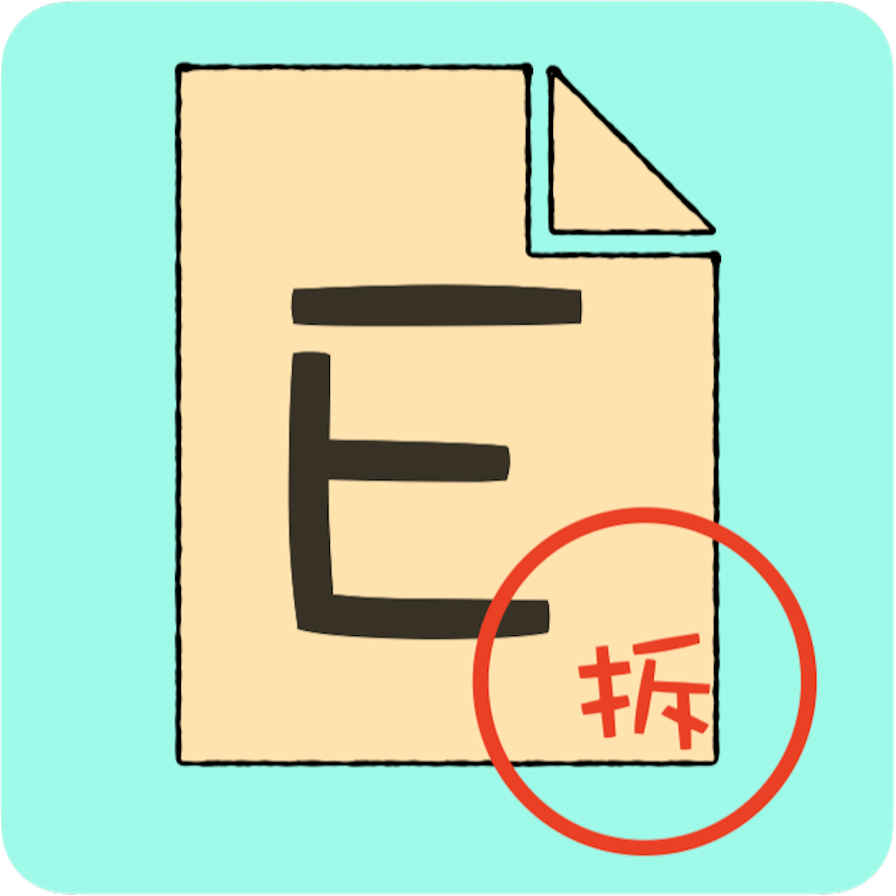
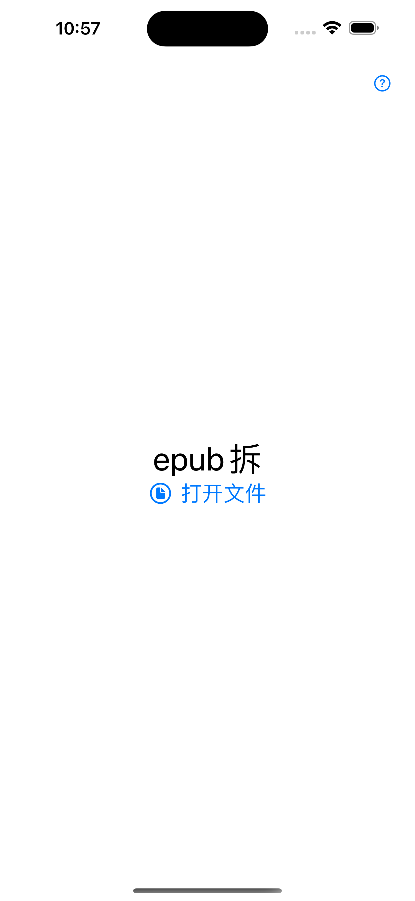
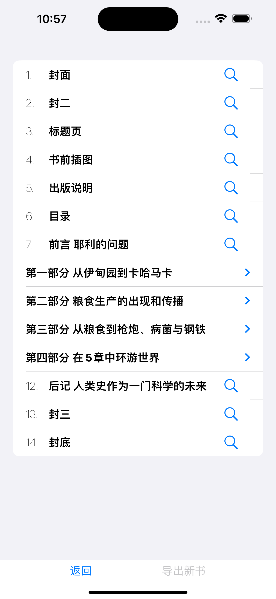

# Epub拆

## 简介
**Epub拆**提供一种简单高效的方法在手机上拆分大的epub文件，以满足部分阅读设备对epub文件大小或目录大小的要求，方便大家的阅读

## 软件界面

Epub拆的软件界面十分简洁，点击右上角的问号图标即可查询使用说明

### 选择图书

点击中间的打开文件即可选择需要拆分的epub电子书

### 选择章节

选择了电子书后，就可以在拆分界面选择想要拆出的章节进行拆分，点击章节名即可选择，点击章节面右边的图标可以预览章节内容，选择好后点击右下方的导出新书即可导出

## 隐私政策

本app不会收集任何用户隐私